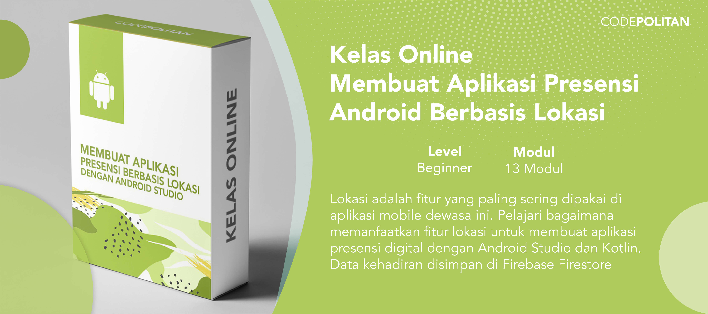

# Source Code Kelas Online Membuat Aplikasi Presensi Android Berbasis Lokasi

## Belajar Membuat Aplikasi Presensi Android Berbasis Lokasi

Dengan mengikuti kelas online ini, kamu akan bisa membuat sebuah aplikasi Android yang memanfaatkan teknologi-teknologi masa kini seperti:

- Location service
- Firebase Realtime Database
- Android Ripple Background
